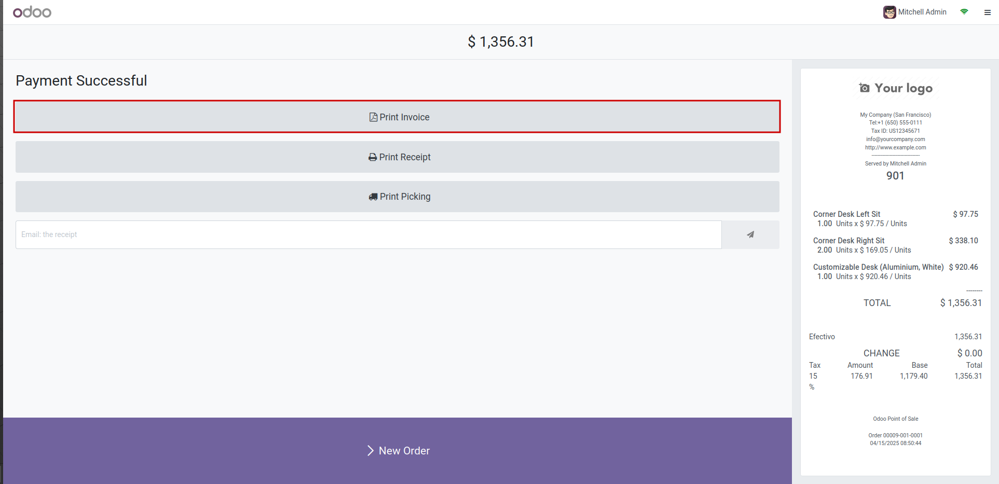

To print an order invoice from the POS:
1. Create a new order and complete the payment.
2. On the receipt screen, click "Print invoice".

This will print the invoice report if it is created.
If it is not it will display an error.
