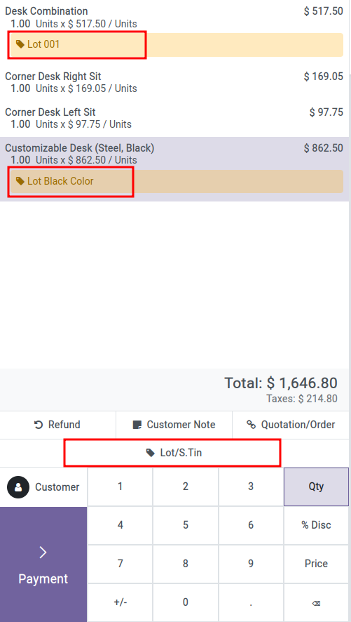
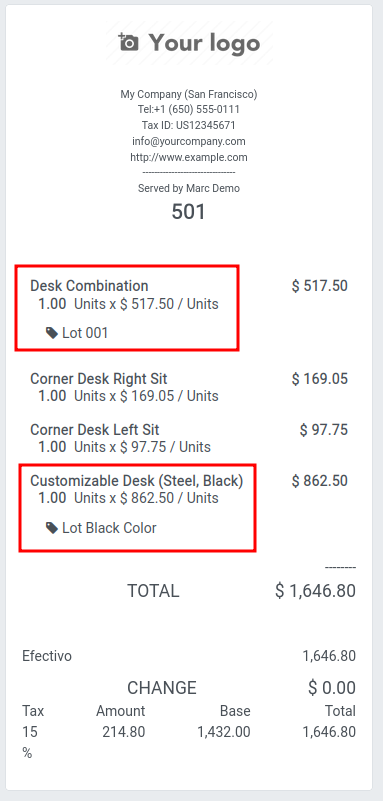
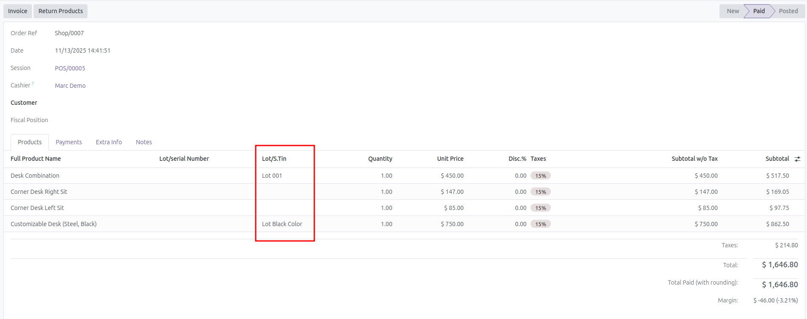
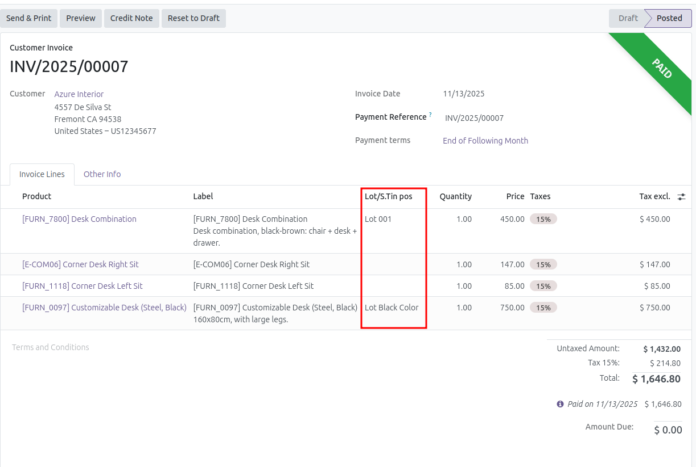

1. When a sale order is doing from the point of sale, new button 'Lot/S.Tin' is available

2. This field also appears on the receipt screen

3. If we view the order from Point of Sale/Orders/Orders

4. And when the order is invoiced

